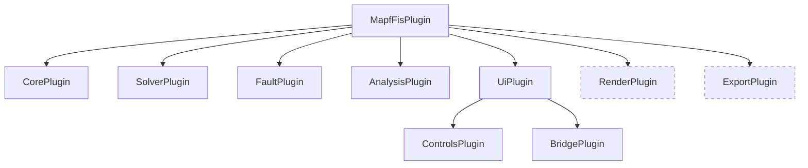
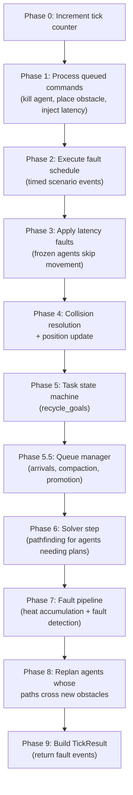
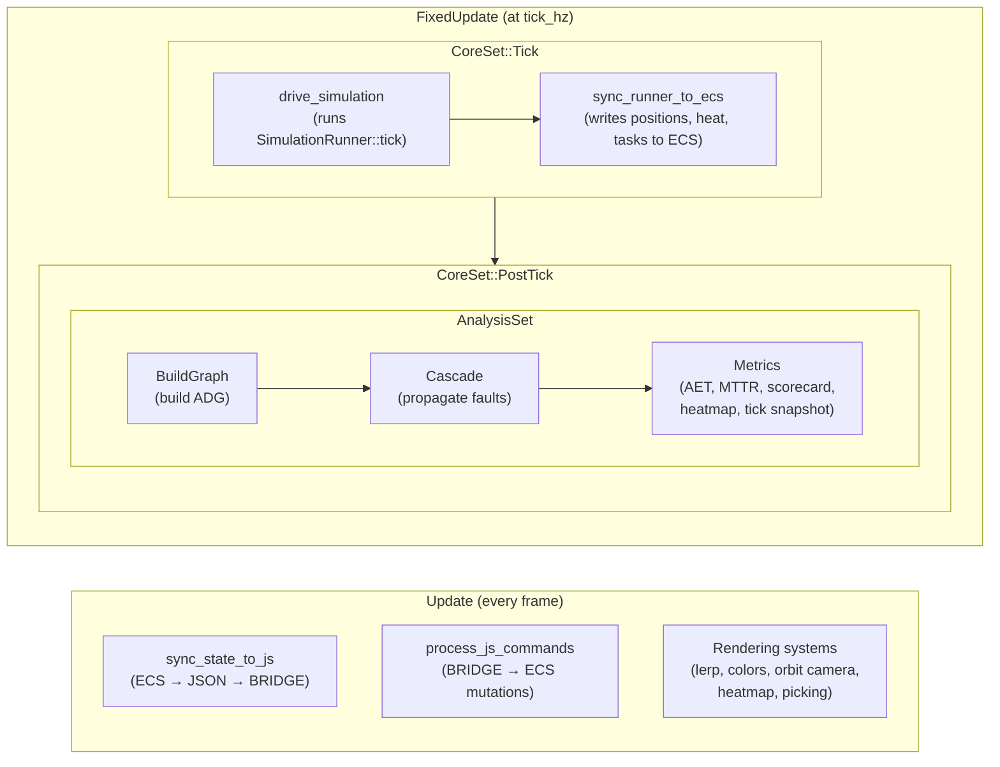
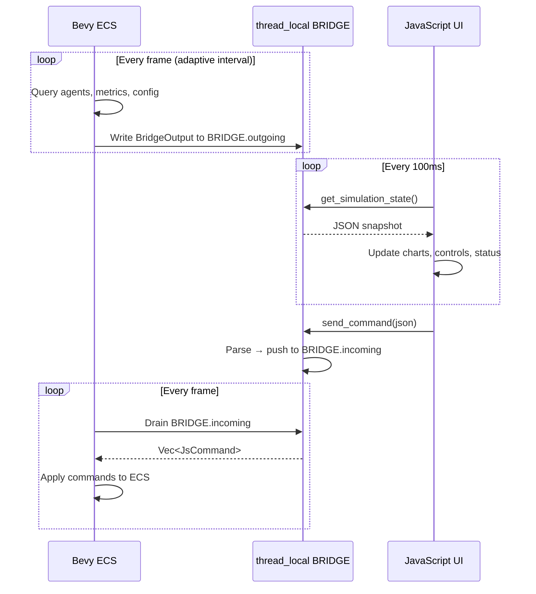
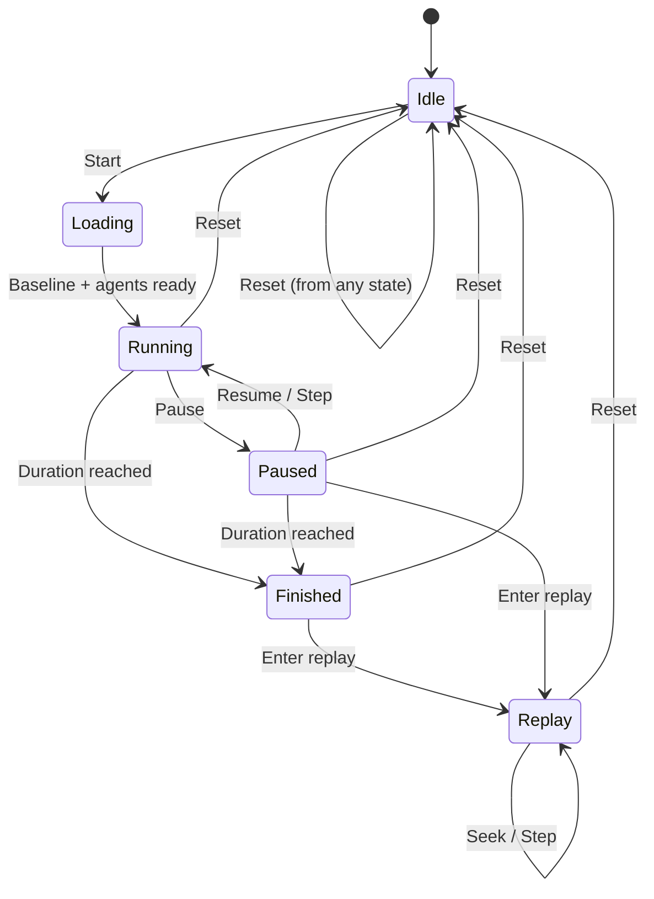

# Architecture

How MAFIS is structured — from the Bevy ECS schedule to the JavaScript UI.

---

## Overview

MAFIS is a Bevy 0.18 application compiled to WebAssembly. The simulation runs in Rust (ECS), and the UI runs in JavaScript. They communicate through a thread-local bridge that serializes state to JSON.

```
┌──────────────────────────────────────────┐
│              Bevy ECS (Rust/WASM)         │
│                                          │
│  FixedUpdate:  Simulation + Analysis     │
│  Update:       Rendering + Bridge sync   │
└─────────────────┬────────────────────────┘
                  │ JSON via thread-local BRIDGE
┌─────────────────▼────────────────────────┐
│           JavaScript / Web UI            │
│                                          │
│  Polls at 100ms, sends commands back     │
│  uPlot charts, HTML controls             │
└──────────────────────────────────────────┘
```

---

## Plugin Structure

The application is composed of plugins, registered in this order:



Dashed = conditional (only in Observatory/WASM builds, not headless).

---

## Tick Execution

Every fixed-timestep tick, the simulation advances through 10 phases in strict order. This all happens inside `SimulationRunner::tick()`.



All phases see the same tick number (incremented first in Phase 0).

---

## ECS Schedule

The Bevy schedule has two layers: **FixedUpdate** (simulation) and **Update** (rendering + bridge).



**FixedUpdate** runs at the configured `tick_hz` (1-30 Hz). **Update** runs every frame (typically 60 fps). The rendering systems interpolate between ticks for smooth visuals.

### Run conditions

| System | Runs when |
|--------|-----------|
| `drive_simulation` | `SimState::Running` and `LiveSim` resource exists |
| `build_adg` | Any cascade or fault metric is enabled, or heatmap criticality mode |
| `propagate_cascade` | Any cascade or fault metric is enabled |
| `update_metrics` | Any core metric is enabled |
| `sync_state_to_js` | Always (WASM only), but adaptive interval throttles frequency |

---

## Bridge Data Flow

The bridge is the communication layer between Rust and JavaScript. It uses a `thread_local` (safe in single-threaded WASM).



### Adaptive sync interval

The bridge doesn't serialize every frame — it throttles based on agent count to avoid JSON overhead:

| Agent count | Sync interval |
|-------------|---------------|
| 1-50 | 90ms |
| 51-200 | 150ms |
| 201-400 | 500ms |
| 400+ | 1000ms |

Above the **aggregate threshold** (50 agents), the bridge sends an `AgentSummary` (counts, average heat, histogram) instead of individual agent snapshots.

### What flows through the bridge

**Rust -> JS (outgoing):**
- Simulation state (tick, duration, tick_hz, state)
- Agent data (positions, goals, heat, task legs — or summary above threshold)
- Metrics (AET, makespan, MTTR, fault counts, cascade depth, scorecard)
- Fault events (last 100)
- Configuration state
- Heatmap mode and visibility
- Task leg distribution counts

**JS -> Rust (incoming commands):**
- Simulation control: start, pause, resume, reset, step
- Configuration: num_agents, seed, tick_hz, solver, topology
- Fault injection: kill agent, place obstacle, inject latency
- Analysis toggles: heatmap mode, metric on/off
- Export triggers
- Camera/graphics presets

---

## Simulation States

The simulation itself has a state machine controlling its lifecycle:



**Loading** runs the fault-free baseline simulation, spawns agents, and computes the initial solve. This happens in the background so the UI stays responsive.

---

## Source Layout

```
src/
  main.rs          Entry point (creates App, configures window)
  lib.rs           MapfFisPlugin + wasm_bindgen exports
  constants.rs     All tunable limits + VERSION constant
  core/            Tick loop, agents, grid, state machine, task scheduling, topology
  solver/          7 lifelong solvers + shared heuristics + A*
  fault/           Heat/wear accumulation, fault detection, replanning
  analysis/        ADG, cascade BFS, metrics, heatmap, scorecard
  render/          Environment, robot visuals, orbit camera, picking/hover (WASM only)
  ui/
    controls.rs    UiState resource
    bridge/        Bevy↔JS bridge (WASM) — serialize.rs, commands.rs, wasm_api.rs
    desktop/       Native egui panels (non-WASM only)
  export/          CSV/JSON export with triggers
  experiment/      Multi-seed experiment runner, stats, paper output
cli/               Standalone CLI binary (cargo run -p mafis-cli)
web/
  index.html       HTML/CSS shell
  app.js           JS polling loop, uPlot charts, bridge commands
  experiment-worker.js  Headless experiment runner (Web Worker)
```
