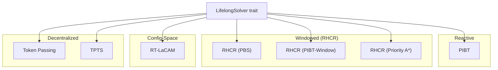
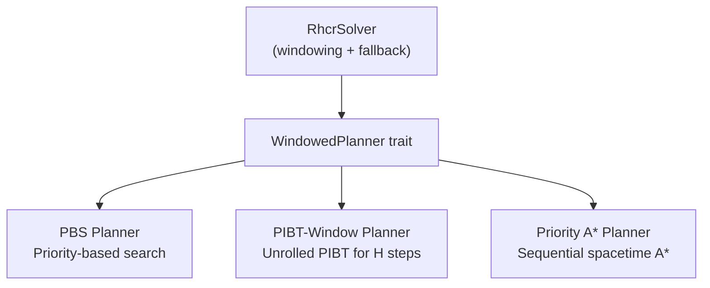
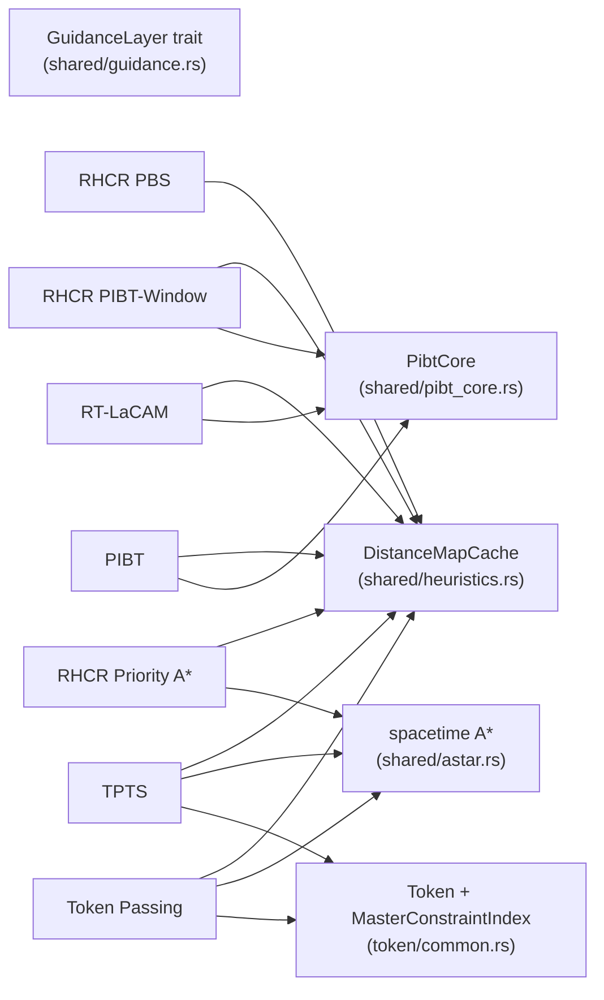
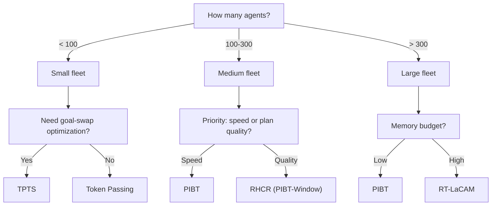

# Solvers

How agents find paths in MAFIS — 7 lifelong solvers across 4 paradigms.

All solvers are **lifelong**: they run continuously, replanning as agents complete tasks and receive new goals. One-shot solvers (CBS, LaCAM, PBS, LNS2) are not part of the active codebase.

---

## Taxonomy



| Solver | ID | Paradigm | Replans | Best for |
|--------|----|----------|---------|----------|
| PIBT | `pibt` | Reactive | Every tick | High density, fast response |
| RHCR (PBS) | `rhcr_pbs` | Windowed | Every W ticks | Moderate density, quality plans |
| RHCR (PIBT-Window) | `rhcr_pibt` | Windowed | Every W ticks | Fast cooperative windowed planning |
| RHCR (Priority A*) | `rhcr_priority_astar` | Windowed | Every W ticks | Moderate density, sequential planning |
| Token Passing | `token_passing` | Decentralized | On demand | Small fleets (up to ~100 agents) |
| RT-LaCAM | `rt_lacam` | Config-Space | Persistent search | Large fleets, persistent exploration |
| TPTS | `tpts` | Decentralized | On demand | Small fleets with goal-swap optimization |

---

## How They Work

### The LifelongSolver Trait

Every solver implements one trait:

```rust
trait LifelongSolver: Send + Sync + 'static {
    fn name(&self) -> &'static str;
    fn step(&mut self, ctx, agents, cache, rng) -> StepResult;
    fn reset(&mut self);
    // ...
}
```

The ECS calls `step()` every tick. The solver returns either `StepResult::Replan(plans)` with new paths, or `StepResult::Continue` (zero-cost — just a counter check).

### PIBT (Priority Inheritance with Backtracking)

The simplest solver. Every tick, each agent tries to move one step toward its goal. If two agents collide, the lower-priority one yields. Priorities rotate so no agent starves.

PIBT is also the **fallback** for other solvers — when RHCR or RT-LaCAM can't find a plan, they fall back to one step of PIBT.

### RHCR (Rolling-Horizon Collision Resolution)

Plans paths for a window of H steps into the future, replanning every W ticks. Three inner planners share the same `RhcrSolver` wrapper:



- **PBS**: searches a binary constraint tree (split on agent pairs). Good plans, but expensive.
- **PIBT-Window**: runs PIBT for H steps without committing moves. Fast and cooperative.
- **Priority A***: plans one agent at a time using spacetime A*, respecting earlier agents' reservations.

All three fall back to one-step PIBT if the window planner fails or times out.

`RhcrConfig::auto(mode, grid_area, num_agents)` computes sensible defaults for H, W, and node limits based on problem size.

### Token Passing

Agents plan one at a time, in order. Each agent plans a spacetime A* path against a shared constraint table (the TOKEN) containing all other agents' committed paths. Tasked agents plan first (PIBT_MAPD-style prioritization).

Works well for small fleets but doesn't scale — each agent's A* search sees all others' paths.

### TPTS (Token Passing with Task Swaps)

Extends Token Passing. Before planning, each agent checks if swapping goals with another agent would reduce total cost (using A* distance evaluation with snapshot/restore). If a beneficial swap exists, the agents exchange goals before planning.

### RT-LaCAM (Real-Time Lazy Constraints)

A configuration-space search that persists across ticks. Each tick, it expands a few nodes (budget-bounded) in a tree where each node represents a full configuration (all agent positions). Uses PIBT as the configuration generator.

Key features:
- **Arena-based node storage** with parent pointers
- **Rerooting**: when agents move between ticks, the search tree re-roots to the new configuration
- **Zobrist hashing**: formula-based (zero allocation, splitmix64 mixing) for fast config comparison
- **Memory cap**: when visited nodes exceed `RT_LACAM_MAX_VISITED`, the search restarts

---

## Shared Code

Several modules are shared across solvers:



- **PibtCore** (`shared/pibt_core.rs`): the shared PIBT algorithm used by standalone PIBT, PIBT-Window, RHCR fallback, and RT-LaCAM's configuration generator.
- **token/common** (`token/common.rs`): `Token` (path store for all agents) and `MasterConstraintIndex` (reference-counted constraints) shared by Token Passing and TPTS.
- **DistanceMapCache** (`shared/heuristics.rs`): cached BFS distance maps from goal cells. All solvers use this for heuristic guidance.
- **spacetime A*** (`shared/astar.rs`): used by Token Passing, TPTS, Priority A*, and PBS for individual agent pathfinding in (x, y, t) space.
- **GuidanceLayer** (`shared/guidance.rs`): trait for pre-computed cell biases + `GuidedSolver` wrapper. Designed for static meta-layers (like GGO).

---

## Choosing a Solver



This is a rough guide — the best solver depends on topology, fault scenario, and what you're measuring. MAFIS exists to let you compare them empirically.

---

## Fidelity

All 7 solvers are documented in [`docs/solver_fidelity.md`](../solver_fidelity.md) with:
- Paper references (author, year, venue)
- Requirement matrices (which aspects match the paper, which deviate)
- Fixes applied and remaining deviations

Two solvers (TPTS, RT-LaCAM) were line-audited against their papers. The remaining five (PIBT, 3 RHCR, Token Passing) are property-verified: collision-freedom, determinism, throughput saturation, and metamorphic properties are tested, but no line-by-line pseudocode comparison was done.

All 7 pass: collision-free verification (500 ticks), deterministic replay, rewind determinism, and scale testing up to 300 agents.
