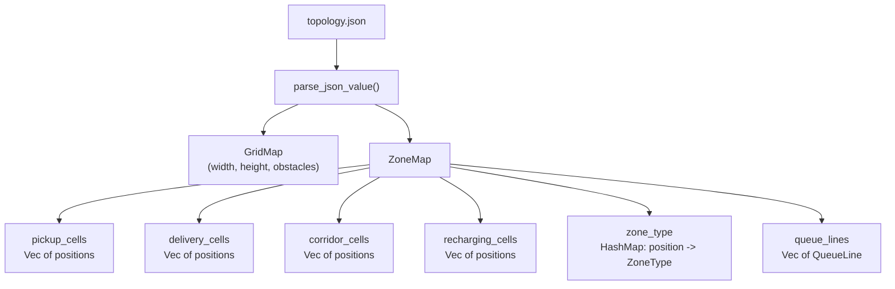

# Topologies

How warehouse layouts are defined in MAFIS.

Topologies are JSON files in `topologies/`. Each one defines a grid: walls, pickup stations, delivery stations, and optional queue directions. No Rust code generates maps — everything is data-driven.

---

## Available Topologies

| Topology | Size | Density | Inspired by | Agents |
|----------|------|---------|-------------|--------|
| Warehouse Medium | 32x21 | 51% | Amazon Kiva (standard) | 20 |
| Kiva Large | 57x33 | 52% | Amazon Robotics (large) | 30 |
| Sorting Center | 40x20 | 43% | FedEx/UPS hub (bidirectional) | 25 |
| Compact Grid | 24x24 | 37% | Ocado micro-fulfillment | 15 |
| Kiva Warehouse | 48x48 | 52% | Amazon Kiva (dense shelf rows, 3-wall deliveries) | 80 |
| Rack Warehouse | 56x32 | 45% | Exotec Skypod (column racks, cross-aisles) | 60 |
| Fulfillment Center | 64x64 | 41% | Multi-dock FC (4 docks, central sorting) | 120 |

All topologies pass BFS connectivity validation (all pickup/delivery cells reachable). Delivery queue directions are distributed across multiple walls for realistic traffic patterns.

---

## JSON Format

Every topology file follows this structure:

```json
{
  "version": 1,
  "name": "My Warehouse",
  "width": 32,
  "height": 24,
  "number_agents": 15,
  "cells": [
    { "x": 0, "y": 0, "type": "wall" },
    { "x": 5, "y": 3, "type": "pickup" },
    { "x": 28, "y": 3, "type": "delivery", "queue_direction": "west" },
    { "x": 16, "y": 1, "type": "recharging" }
  ]
}
```

### Top-level fields

| Field | Required | Description |
|-------|----------|-------------|
| `version` | Yes | Format version (currently `1`) |
| `name` | Yes | Human-readable name |
| `width` | Yes | Grid width in cells |
| `height` | Yes | Grid height in cells |
| `cells` | Yes | Array of cell definitions |
| `number_agents` | Yes | Number of agents to spawn |
| `seed` | No | Random seed |
| `robots` | No | Initial robot positions (`[{x, y}, ...]`) |

### Cell types

| Type | Walkable | Purpose |
|------|----------|---------|
| `wall` | No | Obstacle — agents cannot enter |
| `pickup` | Yes | Pickup station — agents collect cargo here |
| `delivery` | Yes | Delivery station — agents drop off cargo here |
| `recharging` | Yes | Charging station (future energy system) |
| *(anything else)* | Yes | Treated as open floor / corridor |

Any walkable cell not explicitly marked as pickup, delivery, or recharging is automatically classified as a **corridor**.

---

## Zone Map

When the JSON is parsed, the system builds a **ZoneMap** — a lookup structure that the simulation uses for task assignment, queue management, and analysis.



The zone types used internally:

| ZoneType | Description |
|----------|-------------|
| `Storage` | Obstacle (shelf) — not walkable |
| `Pickup` | Walkable, where agents load cargo |
| `Delivery` | Where agents unload cargo |
| `Corridor` | Main aisle (auto-assigned) |
| `CrossAisle` | Vertical aisle cutting through storage |
| `Open` | Generic walkable floor |
| `Recharging` | Charging station |

---

## Queue Lines

Delivery cells can have a **queue direction** — this creates a lane of waiting positions where agents line up before delivering.

```json
{ "x": 1, "y": 2, "type": "delivery", "queue_direction": "east" }
```

This creates a queue extending east from the delivery cell:

```
 [D] [Q0] [Q1] [Q2] [Q3]  →  east
  ↑    ↑
  |    First in line (promoted when D is free)
  Delivery cell
```

- `queue_direction`: `"north"`, `"south"`, `"east"`, or `"west"`
- Maximum queue length: **4 cells**
- Agents join at the back and shuffle forward one slot per tick
- When the delivery cell is free, the agent at Q0 is promoted

If a delivery cell has no `queue_direction`, agents go directly to the delivery cell (no queuing). See [Task Lifecycle](../task-lifecycle/README.md) for the full queue mechanics.

---

## Connectivity Validation

Every topology is validated on load via `validate_connectivity()`:

1. BFS from the first pickup cell explores all reachable walkable cells
2. Every pickup cell must be in the reachable set
3. Every delivery cell must be in the reachable set
4. If any zone cell is unreachable, the topology is rejected with a warning

Maps with no pickup and no delivery cells pass (custom/empty maps). This validation runs inside `parse_json_value()` — broken topologies are caught before the simulation starts.

---

## Creating a New Topology

**Step 1**: Create a JSON file in `topologies/`:

```json
{
  "version": 1,
  "name": "My Layout",
  "width": 20,
  "height": 15,
  "number_agents": 10,
  "cells": [
    { "x": 0, "y": 0, "type": "wall" },
    { "x": 1, "y": 0, "type": "wall" },

    { "x": 3, "y": 5, "type": "pickup" },
    { "x": 3, "y": 10, "type": "pickup" },

    { "x": 17, "y": 5, "type": "delivery", "queue_direction": "west" },
    { "x": 17, "y": 10, "type": "delivery", "queue_direction": "west" }
  ]
}
```

**Step 2**: Rebuild the manifest:

```bash
sh topologies/build-manifest.sh
```

This scans `topologies/` for all `.json` files, generates `manifest.json`, and copies everything to `web/topologies/` for the WASM build.

**Step 3**: Use it in the simulation. The topology ID is the filename with hyphens converted to underscores:
- File: `my-layout.json` -> ID: `my_layout`

Tips:
- Surround the grid with walls to prevent agents from leaving the map
- Place pickups and deliveries on opposite sides for interesting traffic patterns
- Use `queue_direction` pointing away from the delivery cell into open corridors
- `number_agents` helps the UI pick a reasonable default

---

## MovingAI Maps

MAFIS can also parse [MovingAI](https://movingai.com/benchmarks/) `.map` files for benchmark testing:

```
type octile
height 32
width 32
map
....@@@@....
..........@.
@@..........
```

These maps only have walls (`.` = walkable, `@`/`T`/`O`/`W` = obstacle). Use `assign_random_zones()` to designate pickup and delivery cells from the corridor cells.
